            

**Best practice principles**

**of Modelling**

**t** he principles of best practice outlined here are for the purpose of reduc- ing errors and making a model easier to read, audit, update, and use for its intended purpose. This chapter is by no means exhaustive, but outlines the most important principles in using Excel for business analysis and fi- nancial modelling. By following these key principles, your model is easier to navigate and check, and much more likely to be robust, accurate, reliable,

and error‐free.

# 

  
DoCuMent Your assuMptions

Good assumptions documentation is one of the most important principles of best practice. It is impossible to check, validate, or use a model if you are unable to verify the integrity of the data sources or methods of calculation in the model. Your model design, layout, and structure can be perfect, but its validity is really reliant on the assumptions that go into it (i.e., garbage in, garbage out). The most beautifully structured model in the world is pretty useless if the assumptions that go into it are garbage!

Documentation of assumptions helps with validation and avoids misin- terpretation. If there is any possible misunderstanding about why, how, or what the assumptions are in the model, make sure it’s recorded in black and white on the assumptions page.

List assumptions on a separate page, clearly labelled. For a smaller model, you might decide to mix source data and assumptions together, or they could be separated in a large model.

The more detail, the better! If your assumptions are extremely detailed, you could have a section for key assumptions, where you summarise the important assumptions but leave all the detail in case it is needed.

## 55

Document source data and unique calculations as you go. Don’t leave it all to the end and don’t rely on your memory. Months later you or another modeller will have no idea why you calculated something a certain way. Make sure it’s well documented.

# 

  
Linking, not harD CoDing

Financial models are, by definition, dynamic and changing, depending on the input variables, and they need to include links in order to facilitate this. This becomes particularly important when performing scenario and sensi- tivity analysis. Always link as much as possible in your model so that when the inputs change, the outputs also change (which is pretty much the whole point of financial modelling). By linking, you can trace source data back through the links, which makes your model auditable, traceable, and easy to validate.

■ When you link to external files, make sure that you use named ranges. (See “Linking to External Files” in Chapter 4 for greater detail on this.)

■ There should be no hard coding except for input variables, unless refer- enced or source data is listed or it is otherwise _blindingly obvious_ where you got the number from.

■ Never use a value within a formula. The only exceptions are those things that are considered standard or commonly accepted and will not change, such as:

■ 24 hours in a day.

■ 7 days in a week.

■ 60 minutes in an hour.

You may notice that many modellers put input variables in blue font. Whilst this is a bit old‐fashioned, it’s still quite standard practice and it acts as a signal to your user or another modeller that this is a hard‐coded input variable that can change (i.e., _you are allowed to change this value_). The problem with blue font, though, is that you can’t see it when there is no value in the cell, so many modellers use a beige or yellow background with blue font. The use of Styles makes it much easier to format, and Microsoft has helpfully created a Style called “input” in Excel that has become a fairly commonly used standard nowadays in financial modelling, and seems to be used more frequently than the old blue font standard. Styles can be found on the Home Tab in the Styles group, and you can see how to find the input style in Figure 2.6 in Chapter 2. Also see “The Workbook Anatomy of a Model” in Chapter 2 for greater detail on colour coding.

  

# 

  
enter Data onLY onCe

Source data should always be entered only once. For example, list inflation assumptions on the source data or assumption documentation page and, _ev- ery_ time you use inflation in the model, refer back to that cell or row of cells. This will make the model easier and faster to update and less prone to error. Never use a value within a formula. For example, ¼IF(G$6.¼$E7, 136800,0) should have a link, not 136800 typed in. This means that you don’t have to edit each cell when the value changes, and makes the model much easier to audit. However, make sure that you do not link source data to a cell that itself has been linked to the original source. Always go directly to the source data. The result of this malpractice has been aptly termed “daisy‐chaining” in financial modelling best practice circles.1 It is an inefficient and error prone (yet tempting!) practice, and should be avoided when building financial models. It causes the link flow throughout the model to be a lot longer and complex than

it needs to be, and will cause errors if a section of the model is deleted.

# 

  
avoiD BaD haBits

Here are a few bad habits financial modellers can get into:

■ **Hitting** **the Enter** **key** **or** **the green** **check box** **after** **editing** **a formula.** Don’t just click elsewhere. It’s a bad habit many people have, and one that can cause unintentional errors. See “Avoiding Simple Formula Errors” in Chapter 4 for more explanation on how this common habit can cause errors.

■ **Highlighting a range only, instead of the entire row or column.** Using the entire row or column is tempting, but it takes up too much memory and can really slow down the calculation speed. This is often done be- cause the modeller wants to be able to add extra rows to the data, but consider using Tables instead to avoid this problem. See “Structured Reference Tables” in Chapter 8 for how to create Tables.

■ **Daisy‐chaining links throughout the entire model instead of linking to the source,** as described above.

# 

  
use Consistent ForMuLas

In a table or block of data, the same formula should exist all the way across and down the entire block. Use mixed cell referencing to achieve this. (See the section “Cell Referencing Best Practices” in Chapter 5 for a practical

  

1 FAST Modeling Standard, [www.fast‐standard.org.](http://www.fast-standard.org/)

  

exercise on how to do this.) It saves time and avoids errors—and this prac- tice is a keystone to good financial modelling technique. If you only pick up one modeling technique from this book, let this be it!

If you really need to change formulas so that they differ across adjacent cells, you can indicate this with a double border to show that the formula has been broken. This will help with auditing. See the section “Model De- sign” in Chapter 2 on colour coding for an example of how this looks.

■ Avoid blank rows or columns in data blocks where possible, as this can cause problems with sorting, filters, and PivotTables.

■ If sheets are similar, use a template where possible and copy the same sheet. Then when you need to update it, group the sheets to make global changes.

■ Try not to use macros to perform lengthy calculations or manipulations because this reduces transparency. Only in limited areas, such as goal seek on the scenario generation page, should macros be used, and these instances should be clearly documented.

# 

  
ForMat anD LaBeL CLearLY

Formatting and labelling in a model will reduce error and make your model easier to understand. It sounds simple, but, like mixing apples and oranges, mixing units is a common source of error in financial modelling. Clear for- matting and labelling will avoid this.

■ Format cells appropriately. Use symbols for currency (e.g., $, €, £, ¥), the percent symbol (%) for percentages, and commas for thousands. This makes your model easier to read and avoids mistakes and misin- terpretations.

■ Include a dedicated units column (e.g., column C) and make sure the units are entered into that column, (e.g., $, 1,000s, MWh, liters, headcount, etc.).

■ If you decide to round figures into thousands, show this clearly at the top of the row with a descriptive heading such as “Revenue ($1,000s)” to avoid confusion and misinterpretation.

■ Column and row headings should have unit or currency headings and only contain one type of unit or currency.

■ When building multisheet models, columns should be used consistently. For example, if building a model for the period 2017–2027, use column F on each worksheet for 2017, column G for 2018, and so on.

■ It is often a good idea to reserve a column (for example, column D) for constants that apply to all years, months, or days. For example, if

  

growth rate is 5 percent, have that in column D and then link all calcu- lations to column D.

In general, these best‐practice guidelines are really just common sense. Whilst some of them may seem tedious and overly prescriptive to the begin- ner, most of these points are for the purpose of reducing error and bringing increased robustness and clarity to the model. These practices are probably second nature to the experienced financial modeller, who will most likely already follow these guidelines by instinct.

# 

  
MethoDs anD tooLs oF assuMptions DoCuMentation

Many senior managers put a lot of faith in a business case, new venture, or decision supported by a financial model. I’ve seen many cases where manag- ers will blindly decide to go ahead with a project because the financial model seems to indicate that they should. Unless the assumptions are clearly under- stood and listed beside the outputs of the model, the financial model should not be considered a definitive decision‐making tool. Important decisions are made based on the outputs of the model, and it is critical to list the assump- tions that have gone into the model. A model is only as good as the accuracy of the assumptions. It is important to mitigate your liability by documenting your assumptions thoroughly and adding caveats where necessary.

As documentation of assumptions is one of the key points of best prac- tice in financial modelling, let’s take a look at some commonly used methods and Excel tools for including this documentation in a model. All assump- tions should be listed somewhere in the model, but key assumptions should be visible and easily accessible (e.g., via footnotes or statements). The defini- tion of what is classified as a key assumption is somewhat subjective. As the modeller, you need to assess and identify the assumptions that are critical to the model. This could be something to which the model is very sensitive, and in this case, sensitivities should be performed. You may also choose to include the assumptions on which, in your opinion, there has been little re- search available and you are perhaps not entirely comfortable with the data. In such cases, this should be stated, and a recommendation to perform more research proposed.

General notes and instructions about the model should be entered in the cover page of the model, but notes relating to a certain worksheet should be placed in the top area of that particular worksheet. Most assumptions will simply be documented on the assumptions page using straightforward pasted text, but there are a few other sections of the model that may contain

  

assumptions documentation as well, and there are several different methods and techniques for doing this. Greater detail on each tool is outlined in the following list:

■ In‐cell comments

■ Red triangle comment

■ Input message

■ Footnotes

■ Hyperlinks

■ Hard‐coded text

■ Linked, dynamic text

## in-Cell Comments

There are two different methods of creating in‐cell comments: the ordinary comment with the red triangle in the corner (which I will call red triangle comments, as Excel rather unhelpfully simply calls them “comments”), and the less commonly used data validation input message.

Documentation of assumptions using in‐cell comments is most appro- priate for specific matters relating to only one cell or set of calculations, as they can be viewed only in a single cell. These are useful for communicating details to another modeller about specific calculation details, as they will be shown only on the soft copy of the model. More wide‐ranging, generic as- sumptions should be documented using other methods.

Useful comment entries would be sources or assumptions relating to the data in the commented cell. For example, the casual observer of a model may wonder why volume is so low at that time of the year. This can be docu- mented with a comment as shown in Figure 3.1.

  

**Figure 3.1** Assumptions Documentation Using In‐Cell Comment

  

**red triangle Comments** The most commonly used method is to simply insert a comment within the cell as shown in Figure 3.1.

  

You see the red triangle, but the comment doesn’t appear until you hover your mouse over the cell.

In‐cell comments are a good way of documenting models, but they are not usually printed, so they are only helpful on a soft copy of the model. It is possible to print comments, but this isn’t a great option, as they look messy and can cover other numbers or text in the model.

**Data validation input Messages** The less commonly used type of in‐cell com- ment is to use data validations. These types of comments are more discreet, as they do not have the red triangle in the corner, and you don’t see the com- ment until you actually click on the cell. See Figure 3.2.

  

**Figure 3.2** Assumptions Documentation Using Data Validation Input Messages

  

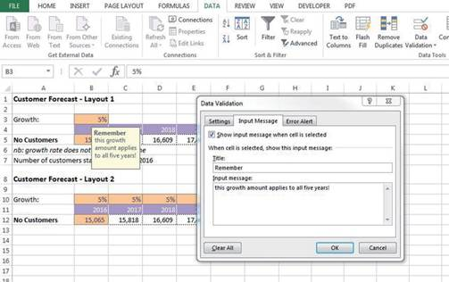

**Figure 3.3** Data Validation Input Message Dialog Box

This sort of in‐cell comment is especially useful for creating little in- structions and warnings regarding input data to users, as they won’t see it until they actually click on the cell to enter the data.

The dialog box will look like Figure 3.3.

Data validations are incredibly useful in financial modelling. For other uses, see the section on “Bulletproofing Your Model” in Chapter 7. Table 3.1 is an overview comparison of the different types of in‐cell comment methods.

  
**t****a****B****L****e** **3.****1** Comparison of In‐Cell Comment Methods

**Red Triangle Comments Input Message Comments**

Can detract from the model, making it look messy.

  

More discreet; don’t distract the eye of the user.

  

Can be viewed all at once. Can only be viewed one at a time.

More obvious to the user. Easily overlooked.

  

Most appropriate for details about a cell‐specific calculation for another modeller’s information.

  

Most appropriate for instructions relating to inputs for the user, as opposed to the modeller.

  

  

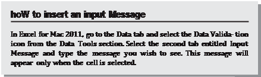

  

My personal preference is to use input message comments wherever possible, as they are neater and cleaner‐looking. Remember, though, that if the cell isn’t selected, the comment won’t be viewed, so make sure that the comment is only cell‐specific. More important, general as- sumptions and comments should use plain text or another method of documentation.

## Footnoting

Unfortunately, the footnote tool in Excel is almost completely useless for assumptions documentation in financial modelling because:

■ It cannot be linked to sections of the model, which greatly limits its usefulness.

■ The modeller cannot see the footnote in the ordinary soft copy working view whilst building the model.

For these reasons, the footnote tool in Excel is really only useful for information such as file names, page numbers, print dates, and times. How- ever, linked footnotes can be done manually by formatting the cell font to superscript.

Footnotes are highly recommended for noting sources of data, assump- tions, and other important information. For an example, see Figure 3.4.

We can go further with this by making the assumptions documenta- tion linked so that the numbers update automatically. How to do this is

  

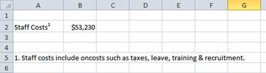

**Figure 3.4** Example of Manual Footnoting in Excel

detailed later in this chapter in the section “Linked Dynamic Text Assump- tions Documentation.”

## hyperlinks

There are two different types of hyperlinks that are useful in financial mod- elling: URL web links and links to other files or locations within the model.

**Cell and File hyperlinks** You can also create hyperlinks to source or other reference files and other sections of a model. They can aid in navigation of a long and complex model and are especially helpful for new users to find their way around the model.

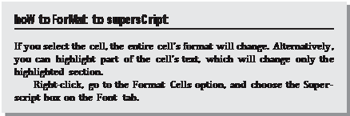

  

  

  

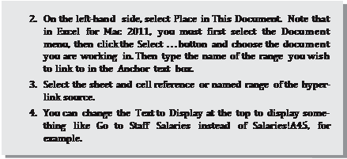

Similarly, you can insert a hyperlink to another file in your source refer- encing as shown below.

Test this out on one of your models. This is useful if you obtained data from another file and want to document it as a source reference without retaining links in the model.

  

Bear in mind that unlike formula links, hyperlinks do not move if the source cell moves. If you create a hyperlink to a cell on another tab (e.g., A1), and then insert a row above row 1, the hyperlink will not auto- matically update to A2 as a linked formula would.

For this reason it is a good idea to hyperlink to a named range rather than a cell reference, as hyperlinks do not follow insertion or deletion of rows and columns, and this will make your model more robust. To learn how to create a named range, see the box on “How to Create a Named Range” in Chapter 5.

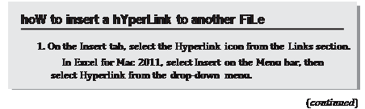

  

  

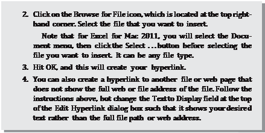

**Web urL hyperlinks** Hyperlinks can also be used to refer to relevant Internet or intranet sites directly from your spreadsheet. For example, if the tax rate we have assumed in our model was obtained from the World Health Orga- nization (WHO), we should put a reference to the WHO next to the assump- tion as shown in the “How to Insert a Website Hyperlink” box.

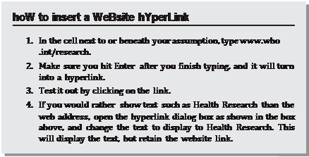

  

## hard-Coded text

This method of assumptions documentation is not very sophisticated, but like with many things in financial modelling, a simple solution is often best. It’s fairly obvious in the calculations in row 5 of Figure 3.5 that the growth rate does not change over time, but the modeller is making it

  

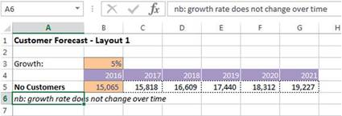

**Figure 3.5** Hard‐Coded Assumptions Documentation

absolutely, explicitly clear by typing the hard‐coded text below the table. There is no danger here that a modeller or user can overlook this assump- tion, whether it is being viewed in soft copy or has been printed out.

# 

  
LinkeD DYnaMiC text assuMptions DoCuMentation

Documenting assumptions liberally within your model is very important— however, it is very difficult to keep the documentation up‐to‐date when your model is dynamic and inputs are continually changing.

For example, in a business case it would be useful to put the cost of capi- tal next to the net present value (NPV), as this is a very important assumption. If we type “Cost of capital is 12 percent,” however, it will be out‐of‐date as soon as we change the assumption, and there is a very high risk that we could distribute the model with incorrect assumption documentation. The answer to this is to use an ampersand (the “&” symbol). The CONCATENATE func- tion will do a similar thing, but using the ampersand is quicker to build (and easier to spell)! You can join any cells together by using this symbol.

## practical exercise 1

Let’s try a basic exercise of seven steps to get the hang of how the ampersand works. This is demonstrated in Figure 3.6.

**1.** Practice this in a blank worksheet: Type **Hello** in cell A1 and **Robert** in cell B1.

**2.** In another cell, type the formula \=**A1&B1**, which will give you the re- sult **HelloRobert**.

**3.** Now try adding some text. For example, \=**A1&B1&"how are you?"**

will give you the result: **HelloRobert how are you?**

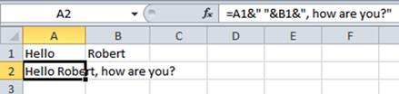

**Figure 3.6** Linking Text Using Ampersand

**4.** Next add a space between **Hello** and **Robert** like this: \=**A1&""&B1&" how are you?"**

**5.** Now add a comma after **Robert** like this: \=**A1&""&B1&,"** **how** **are** **you?".**

**6.** Your sheet should look like the sample in Figure 3.6.

**7.** Now change the word **Robert** to **Mary** and see how your text changes.

## practical exercise 2

**1.** Go to a model and practice creating a sentence using linked text to document an assumption.

**2.** For example, number of customers starts at 15,065 in 2016, as shown in Figure 3.7.

**3.** Practice changing either the date or the beginning number of customers and watch the text change.

**4.** If you want to format the number so that it shows as 15,065 instead of 15065, you can use the TEXT function like this: \=TEXT(B5, **"**###,###**"**) Remember that this function turns the data to text, so it is no longer a number. You can find out the format that the TEXT function required by going into Custom Formatting, as shown in Figure 3.8, by right‐ clicking on a cell, selecting Format Cells and Custom.

**5.** The total formula would be: \=**"Number of customers starts at "&TEXT (B5, "###,###")&" in "&B4.**

  

**Figure 3.7** Linked Dynamic Assumptions Documentation

  

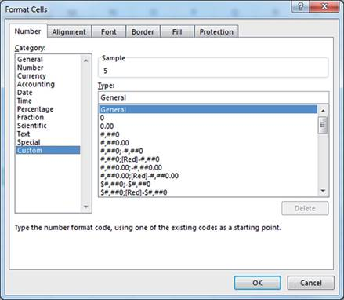

**Figure 3.8** Format Cells Dialog Box

## practical exercise 3

This seven‐step method of documentation can also be used in reporting to create commentary on outputs. This commentary can then be easily copied to Word or PowerPoint.

**1.** Create a simple calculation on a new worksheet as shown in Figure 3.9.

**2.** The formula in cell B4 should be \=**B2‐B3** and the formula in cell B5 should be \=**B4/B2**.

**3.** Now in cell A7 create a comment that says **Profit margin is 20%**. Re- member to use the TEXT function to format it as a percentage.

**4.** Your formula should be \=**"Profit Margin is" &TEXT(B5, "#%")**.

**5.** Now try changing the revenue amount to $3 million. Your profit margin changes to 33 percent, and your text commentary still remains accurate. Change the revenue back to $2.5 million.

  

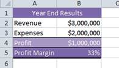

**Figure 3.9** Practical Commentary Exercise

**6.** If you would like the text to say **Profit margin is 33.33%** instead of

**33%**, add some decimal places to your formula after the # symbol:

\=**"Profit Margin is "&TEXT (B**\=**,"#.##%")**.

**7.** Your sheet should look like Figure 3.10.

# 

  
What Makes a gooD MoDeL?

A well‐built model will have the following user‐friendly features and struc- tural attributes:

### User‐Friendly Features

■ Well‐documented assumptions, so there is no possibility of misunder- standing or misinterpretation of the model.

■ Explanation of the functionality. Many models lack this. What is the model for? How do I use it and where do I input data?

  

**Figure 3.10** Practical Commentary Exercise (Completed)

  

■ Logical flow (left to right and top to bottom).

■ Inputs and outputs, workings, and results are clear and easy to find.

■ Built‐in error checks and input validation such that the user is aware as soon as there is an invalid entry or calculations are not correct.

■ Easy navigation to help users find desired information. Use a hyper- linked table of contents to help users find their way around if there are a large number of tabs.

■ Instructions on how to use it if the functionality is not self‐explanatory or obvious. These instructions could be dispersed throughout the document in the form of comments (my preference) or as a separate instructions page.

■ Printability so outputs are summarised and fit onto printable pages, which are easy to read. Reports are legible and colours are not too dark.

■ Formatting that is easy on the eye and consistent. The whole model should have the same look and feel even if different modellers have built different parts of it.

■ The user should be able to access summarised information as well as the detail. Each page should form the backup data and source information. Users should be able to print or distribute this page if further informa- tion is required.

### Structural Features

■ The only hard coding should be the inputs and source data. The sources or assumptions for these must be documented. All other information is linked.

■ Duplication is minimised.

■ Names, formulas, and formats should follow a consistent convention.

■ The model should be built in a modular form so that pieces can be re- moved and reused if required.

■ The build is logical such that each topic is handled on a different sec- tion, and similar inputs or calculations are grouped together.

■ The most efficient function is used.

■ The model should be scalable so that greater detail or a large number of units, for example, can be added with minimal rework.

At [www.wiley.com/go/steinfairhurstrevised,](http://www.wiley.com/go/steinfairhurstrevised) you will be able to down- load a model assessment checklist, which will help you to assess how a model stacks up against financial modelling best practices.

**standards in Financial Modelling**

There have been some good attempts in recent years to standardise finan- cial modelling practice, with good reason. Excel is such a flexible tool that anyone can jump in and start creating the most frighteningly poorly designed

  

and error‐prone models—and they do! The FAST Modelling Standard is a philosophy that promotes FAST (Flexible, Accurate, Structured, and Transparent) design, and a recently developed methodology called SMART focuses on transparency, flexibility, and presentation. To download these standards, refer to the list of online resources that can be found at [www.wiley](http://www.wiley.com/go/steinfairhurstrevised)

[.com/go/steinfairhurstrevised.](http://www.wiley.com/go/steinfairhurstrevised)

Whichever methodology you follow, using the key principles outlined in this chapter or in the above methodologies, your model will be easier to navigate and check, and much more likely to be robust, accurate, reliable, and error‐free.

# 

  
suMMarY

By following the points of modelling best practice such as assumptions documentation, linking, only entering data once, ensuring formulas are consistent, and avoiding bad modelling habits, financial modellers can be sure that their models are more robust, have fewer errors, and are easier to audit. One of the most important principles of best practice is to document assumptions, and this chapter lists different technical methods of assump- tions documentation, such as comments, footnoting, hyperlinks, and linked text. We also explored the features and structural attributes of a well‐built financial model.