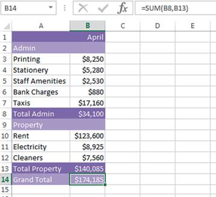
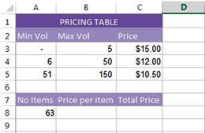
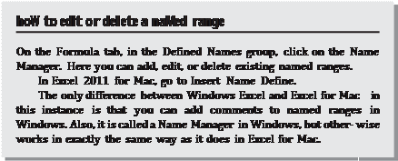

            

**Using excel in Financial Modelling**

**I** n this chapter, we take a look at some of the practical tools, functions, and formulas commonly used in financial modelling in Excel.

# 

  
ForMUlas and FUnCtIons In exCel

Excel contains over 300 different formula codes, called functions. The most commonly known function is the SUM, used to total a range of cells. Most Excel users only use a very small percentage of the available functions, and many of them are irrelevant for use in finance and financial modelling. It is impossible to go over all of them, but here we will cover the ones that are going to be the most useful in using Excel for business analysis.

In most cases, you will find it easiest to use the Function Wizard, acces- sible via the “Insert Function” button on the “Formulas” tab as shown in Figures 5.1 and 5.2.

Note that the Function Wizard is called the Formula Builder in Excel for Mac 2011; however we will refer to it as the Function Wizard in future for simplicity.

It’s fair to say that some Excel users are guilty of using Excel as a fancy calculator! If so, you’d be just using a formula in Excel, such as **\=A1+A2** or

### \=452\*12.

There are, however, predefined formulas in Excel such as IF, SUM, VLOOK- UP, INDEX (and several hundred more). These are referred to as functions.

So, you could write a formula containing a function, like **\=MAX(A1:B20)**, or you could just write a simple formula that does not contain a function, like **\=A1/A2**. Many of us use the words _formula_ and _function_ interchange- ably, but it’s nice to know the difference!

**97**

  

**FIgUre 5.1** Function Wizard

Because there are hundreds of functions in Excel, you should familiarise yourself with as many as possible, so that you know what is available.

For use in business analysis, the most useful functions fall into the cat- egories of logical, aggregation, lookup, and financial. The most commonly used functions in financial modelling are listed here:

■ **Logical** functions (IF, AND, etc.) are used when you need to evaluate a condition. For example: “Shall we include tax in our calculation?” If the user enters **yes**, the calculation will include the tax; if **no**, it is excluded.

■ **Aggregation** functions (SUMIF, COUNTIF, etc.) are helpful when there is a lot of data arranged either vertically or horizontally that must be added together.

■ **Lookup** functions (HLOOKUP, VLOOKUP, etc.) are used when you need to look up a value to return a single amount.

  

**FIgUre 5.2** Formula Builder in Excel for Mac 2011

■ **Financial** functions (NPV, IRR, PMT, etc.) can usually be created manu- ally using a long and complicated formula, but the predefined function in Excel saves time and makes it much easier to calculate commonly used financial calculations such as net present value, interest payments, or depreciation amounts.

There is a bit more, like choosing the right function, however, than sim- ply knowing lots and lots of functions in Excel. Choose the simplest formula to perform the task you need it to do. Choose one that is not overly compli- cated and don’t try to do too much in one cell. If it starts getting difficult to decipher, consider breaking the formula into several parts. See “How Long Should a Formula Be?” in Chapter 4 for an example of this.

  

**FIgUre 5.3** Compounding Growth Rate Calculation Using a Helper Row

As with most tools in financial modelling, you should choose the simplest option—not because you don’t know how to do a more sophisticated func- tion, but because you want to make the model as clear, simple, and transpar- ent as possible. However, you still need to arm yourself with as many different functions as possible. The more you know, the more options you have avail- able to you, and the more likely you are to find the best solution.

For example, Figure 5.3 shows the calculation of a compound growth rate when escalating the starting sales number by 5 percent to the power of the year. In order to do this, we’ve had to insert a helper row to link to. This makes the formula easier to follow, but a helper row is distracting and makes the model look messy, so it needs to be hidden. The entire row cannot be hidden in this instance, so we’d probably change the font to a pale grey to make it less distracting

Alternatively, we can achieve the same result without the helper row as shown in Figure 5.4 by calculating it all in one cell. Instead of inserting 1, 2, 3, and so on across the top, we can do the entire calculation in one cell by looking at the difference between the years; in this case, 2016 minus 2016 equals zero, and 2017 minus 2016 equals one, and so on.

Using the second method, the value 1 in the helper row has been re- placed by the formula (C9‐$B$9). This makes the second formula more dif- ficult to follow, but the model is less cluttered.

This is an example of how a modeller needs to strike the balance be- tween having a streamlined model, yet formulas that are easy to follow.

  

**FIgUre 5.4** Compounding Growth Rate Calculation without a Helper Row

  

Either of these methods would be perfectly acceptable, but as this is not a terribly long or complicated formula, the second option is probably prefer- able because it avoids the addition of a potentially confusing helper row.

# 

  
exCel VersIons

There are currently several different versions of Excel available in Microsoft Windows that modellers are likely to be using. Each time a new version of Excel is launched, new features are introduced, and subtle changes in the look and feel take place. The biggest change was back with the big jump from Excel 2003 to 2007; in the versions since then, the changes have been less noticeable.

If you are building models in Excel that other people using different ver- sions need to use, then you need to consider the version capabilities when building your models. The following features were introduced in Excel 2010:

■ Power Pivot (See Chapter 1)

■ Sparklines (See Chapter 7)

■ Slicers in PivotTables (See Chapter 8)

It’s important to be aware that these features did not exist in previous versions of Excel, so if you are creating a model that contains sparklines or slicers, and the model is opened by a user still on Excel 2007, those features will disappear from their model, and there will be a blank field in their place! Similarly, the new functions that have been introduced in 2013 such as PDURATION() or ISFORMULA() will return a #NAME? error when opened in Excel 2010 or earlier.

## summary of new Features

At a high level, here is a quick summary of the new features introduced in Excel 2013.

#### General

■ Interface look and feel with the capitalisation of the Ribbon.

■ Start screen.

■ New mobility options allow access to different devices on one licence.

#### Analysis

■ Flash Fill will learn the pattern of the data you’re entering and complete it for you.

  

■ Quick Analysis makes it easy to analyse your data with formatting and charts after highlighting with the mouse.

#### Charting

■ Chart Recommendations and Customisations.

■ The Layout tab for charting has disappeared from the Ribbon, and Chart Elements appear to the right of the chart itself.

■ More Data Labelling options for charts.

#### Functions

As with every new version, Excel has introduced a number of new func- tions. This time, there are no fewer than 50 new predefined functions to enhance the already rich function set. Most are for the purpose of math, trigonometry, and engineering, but here are a few worth mentioning that you might find useful for financial modelling:

■ PDURATION() returns the number of investment periods required for the invested amount get to the specific value.

■ IFNA() allows you to suppress a #N/A error only.

■ ISFORMULA() will return the value TRUE if the cell contains a for- mula.

## other Features

■ Single window per worksheet allows the same session of Excel to show different files on multiple monitors (my personal favourite!).

■ New web‐based functions help in building links to web services, reading XML content, and connecting with online content.

■ You can create relationships between tables for enhanced data analysis without having to consolidate all the information into a single table and create pivot charts.

■ Slicers, previously only available for PivotTables, are now available in Excel tables as well.

■ Power Pivot is now a built‐in feature of Excel 2013.

For more detailed explanations of the changes between versions and how they impact model building, please see [www.wiley.com/go/steinfairhurstrevised](http://www.wiley.com/go/steinfairhurstrevised) to download supplementary material in PDF format. This section also discuss- es the difference between using Windows and Mac for financial modelling.

This book assumes readers are using Windows Excel 2013, but in most cases instructions for Excel 2010, 2007, and Excel for Mac 2011 have also been provided.

  

# 

  
handy exCel shortCUts

Working in Excel—particularly for the purpose of financial modelling—can be very time consuming, and increasing your speed and accuracy will in- crease productivity significantly. Excel users just starting out with using Excel would be very comfortable with using the mouse for navigation and editing purposes. However, with growing familiarity, the mouse is not the fastest or most efficient way of modelling. Excel offers a lot of shortcuts to tackle this problem, and as you become faster, you will find them very handy.

There are many advantages of using Excel shortcuts:

■ **Ease of use:** Whilst intuitively it may seem that a mouse is the more comfortable option, it is a lot more comfortable for your wrist, arm, and shoulders to punch the keys on the keyboard than to align the cur- sor on the screen.

■ **Easier on the body:** Given the natural placement of keyboard and mouse on any desktop, using the keyboard more often is less stress- ful on the body. Using the mouse constantly can cause stress on the wrists and shoulders. With the mouse most users typically end up using just the wrists and index finger, which can cause fatigue and long‐term problems.

■ **Speed of execution:** Keystrokes are much faster than the mouse. To put this to the test, try creating a new worksheet in Excel using the mouse by clicking on File (or the Microsoft Button in Excel 2007), then New— Blank Workbook. Alternatively try the shortcut CTRL‐N. There is a distinct improvement in speed with keystrokes over the mouse click.

■ **Standard shortcuts:** Within the Windows environment, you will find that similar functions have the same shortcuts, so the expertise you de- velop can be applied to programs other than Excel. The shortcuts in Excel are generally common across all other office suites and even other applications like browsers, Notepad, Paintbrush, and more.

■ **No other choice:** There are some functions for which shortcuts are nec- essary to get the desired results, unless you want to insert manual edits. For example, when creating an array formula, the Control‐Shift‐Enter shortcut is the only way to get your array formula to insert correctly.

## Windows shortcuts

Table 5.1 is a small selection of some of the most common and particu- larly useful shortcuts that are invaluable when using Excel for financial modelling. Note that a printable list of these shortcuts is also available at [www.wiley.com/go/steinfairhurstrevised.](http://www.wiley.com/go/steinfairhurstrevised)

  

  **Tip**

Any command that is shown on the ribbon can be activated by clicking on the icon using the mouse, but can also be activated using shortcut keys. These are displayed when the AlT key is pressed, as can be seen in figure 5.5. for example, Wrap Text can be selected by using the shortcut AlT, pressing H (not case-sensitive), and then W.

**FIgUre 5.5** Shortcut Keys Shown after Pressing the ALT Key

Also note that the Quick Access Toolbar (highlighted in figure 5.5) can also be customised to contain commands that are frequently used. in figure 5.5, Paste Values and Print Pre\- view have been added to the Quick Access Toolbar so that the user can simply press AlT, then 5 to Print Preview, hence saving three mouse clicks. The Quick Access Toolbar op- tions need to be manually customised, and this can be done by clicking on the drop-down to the right of the Quick Access Toolbar, and then selecting More commands.

  
**t****a****b****l****e** **5.****1** **Useful** **W****indows** **Keyboard** **s****hortcuts** **for** **Financial** **Modellers**

**Editing**

CTRL+S Save workbook

CTRL+C Copy

CTRL+V Paste

CTRL+X Cut

CTRL+Z Undo

CTRL+Y Redo

CTRL+A Select all

CTRL+R Copies the far left cell across the range\*

CTRL+D Copies the top cell down the range\*

CTRL+B Bold

  

**Editing** (_continued_)

ALT+TAB Switch program

ALT+F4 Close program

CTRL+N New workbook

SHIFT+F11 New worksheet

CTRL+W Close worksheet\*

ALT+E+L Delete a sheet\*

CTRL+TAB Switch workbooks

**Navigating**

CTRL+9 Hide row

SHIFT+CTRL+9 Unhide row

SHIFT+Spacebar Highlight row

CTRL+Spacebar Highlight column

CTRL+Minus sign Delete selected cells

Arrow keys Move to new cells

CTRL+Pg Up/Down Switch worksheets

CTRL+Arrow keys Go to end of continuous range and select a cell SHIFT+Arrow keys Select range

SHIFT+CTRL+Arrow Select continuous range Home Move to beginning of line

CTRL+Home Move to cell “A1”

SHIFT+ENTER Move to cell above

TAB Move to cell to the right

SHIFT+TAB Move to cell to the left

ALT+Down arrow Display a drop‐down list

**Formatting**

CTRL+1 Format box

ALT+H+0 Increase decimal\*

ALT+H+9 Decrease decimal\*

SHIFT+CTRL+B General format

SHIFT+CTRL+! Number format

SHIFT+CTRL+# Date format

SHIFT+CTRL+$ Currency format

SHIFT+CTRL+% Percentage format

(_continued_)

## 105

  

  
**table 5.1** (_continued_)

**In Formulas**

F2 Edit formula, showing precedent cells

CTRL+’ Edit formula, showing precedent cells (same as F2)

ALT+ENTER Start new line in same cell

SHIFT+Arrow Highlight within cells

F4 Change absolute referencing (“$”)

ESC Cancel a cell entry

\= (equal sign) Start a formula

ALT+”=“ Sum selected cells

CTRL+\` Copy formula from above cell

CTRL+B Show formulas or values

F9 Recalculate all workbooks

SHIFT+CTRL+Enter Enter array formula

ALT+M+P Trace immediate precedents\*

ALT+M+D Trace immediate dependents\*

ALT+M+A+A Remove tracing arrows\*

CTRL+\[ Highlight precedent cells

CTRL+\] Highlight dependent cells

F5+Enter Go back to original cell

SHIFT+CTRL+{ Trace all precedents (indirect)

  
SHIFT+CTRL+} Trace all dependents (indirect)

_\*Note that these are unavailable as preset keyboard shortcuts for Mac for Excel 2011. Create shortcuts for these functions by selecting Tools—Customize Keyboard._

## Mac shortcuts

Almost all of the keyboard shortcuts that are available for Windows are avail- able on the Mac version as well. If you are new to Mac, remember that in most cases, Command replaces Control, and Option replaces Alt. See Table 5.2.

A few of the keyboard shortcuts found in Excel for Windows are un- available for Mac (as noted in Table 5.1). These, however, may be created manually by selecting Tools—Customize Keyboard.

  

  
**t****a****b****l****e** **5.****2** **Useful** **Mac** **Keyboard** **s****hortcuts** **for** **Financial** **Modellers**

**Editing**

COMMAND+S Save workbook

COMMAND+C Copy

COMMAND+V Paste

COMMAND+X Cut

COMMAND+Z Undo

COMMAND+Y Redo

COMMAND+A Select all in an area

COMMAND+A twice Select all data on the sheet

COMMAND+B Bold

COMMAND+TAB Switch program

COMMAND+Q Close program

COMMAND+N New workbook

CONTROL+TAB Switch workbooks

COMMAND+page up Select next worksheet to the right

COMMAND+page down Select next worksheet to the left

**Navigating**

CONTROL+9 Hide row

SHIFT+CONTROL+9 Unhide row

SHIFT+Spacebar Highlight row

CONTROL+Spacebar Highlight column

CONTROL+Minus sign Delete selected cells

Arrow keys Move to new cells

COMMAND+Pg Up/Down Switch worksheets

COMMAND+Arrow keys Go to end of continuous range and select a cell

SHIFT+Arrow keys Select range

SHIFT+COMMAND+Arrow Select continuous range

Function+Left Arrow Move to beginning of line COMMAND+Function+Left Arrow Move to cell “A1” SHIFT+ENTER Move to cell above

(_continued_)

## 107

  

  
**t****a****b****l****e** **5.****2** (_continued_)

**Editing**

TAB Move to cell to the right

SHIFT+TAB Move to cell to the left

CONTROL+Down arrow Display a drop‐down list

**Formatting**

COMMAND+1 Format box

SHIFT+CONTROL+B General format

SHIFT+CONTROL+! Number format

SHIFT+CONTROL+# Date format

SHIFT+CONTROL+$ Currency format

SHIFT+CONTROL+% Percentage format

**In Formulas**

CONTROL+U Edit formula, showing precedent cells

CONTROL+OPTION+RETURN Start new line in same cell SHIFT+Arrow Highlight within cells

COMMAND+T Change absolute referencing (“$”)

ESC Cancel a cell entry

\= (equal sign) Start a formula

CONTROL+SHIFT+T Sum selected cells

COMMAND+\` Copy formula from above cell

CONTROL+ Show formulas or values

F9 Recalculate all workbooks (Note that

the user will have to inactivate Expose in order for this shortcut to work)

SHIFT+CONTROL+RETURN Enter array formula

**Auditing**

COMMAND+\[ Highlight precedent cells

COMMAND+\] Highlight dependent cells

SHIFT+COMMAND+{ Trace all precedents (indirect)

  
SHIFT+COMMAND+} Trace all dependents (indirect)

**108**

  

# 

  
basIC exCel FUnCtIons

Now that we understand the basics of formulas and functions in Excel, it is time to start looking at some of the basic Excel functions. With financial modelling—or any other use for Excel for that matter—it is highly unlikely that the entire range of Excel functions will get used. However, the more functions we know, the better equipped we are to translate our business logic into a highly functional, dynamic, and robust financial model.

There are some common basic functions that are used frequently, and understanding them is important for any modeller. Some of the basic math- ematical functions included in the Excel suite are: SUM(), MAX(), MIN(), COUNT(), and AVERAGE(). The function names are indicative of the functions they perform.

## sUM()

This function is used to sum up a series of numbers. You can add individual cells, by separating them with commas, and you can also specify a range of cells. Figure 5.6 is an example of using a comma in the SUM function.

  

**FIgUre 5.6** Using the SUM Function

  

  
**Note**

you can use ranges as well as numbers in the sUM() function; just separate each entry by a comma.

  

## Max()

This function helps identify the maximum value. The syntax for this func- tion is very similar to SUM(); you can enter a range of cells, individual cells separated by commas, or a combination of both. This function will return an error if the cells you need to analyse have some text that cannot be con- verted appropriately. Similarly, if the cells do not contain any numbers, the function returns 0. See Figure 5.7 in which the maximum average monthly temperatures have been calculated for various cities around the world.

## MIn()

This function is the inverse of the MAX() function, giving the least value in the list. The MIN() function can also use any combination of ranged series and individual cells. The limitations on inputs and the results are similar to the MAX() function. In Figure 5.8, the MIN() function has been used to calculate the minimum average monthly temperatures.

  

**FIgUre 5.7** Using the MAX Function

  

**FIgUre 5.8** Using the MIN Function

## aVerage()

As the name suggests, this function calculates the average, or mean of the numbers in the list. AVERAGE is a very useful function in certain situations, as can be seen in Figure 5.9.

  

## Combining basic Functions

These basic functions can be used individually to calculate the respective results, but they can also be used in combination for various calculations. For example, if you want to find the maximum deviation (or range of values) in the values, you could subtract the maximum and minimum value. So you would have a formula such as **\=MAX(B2:B8)‐MIN(B2:B8),** as shown in Figure 5.10.

  

**FIgUre 5.9** Using the AVERAGE Function

  

**FIgUre 5.10** Combining Functions to Calculate the Deviation

# 

  
logICal FUnCtIons

Logical functions, particularly IF statements, are very commonly used in financial models because they allow the user to turn on and off certain calculations, and create scenarios and certain conditions or thresholds for calculations to maintain.

## IF statement

The IF statement takes three fields (Excel calls them arguments, but I’m going to stick with the term “field”):

Where:

Field 1 = the logical expression that is evaluated. Field 2 \= the result if Field 1 is true.

Field 3 = the result if Field 1 is false. The syntax therefore looks like this:

### \= IF(statement being tested, value if true, value if false)

  

The first field consists of a logical expression (i.e., something that, when evaluated, is either TRUE or FALSE). The expression in the first field is evaluated. If it is TRUE, then the IF statement returns the value of the second field. If it is FALSE, then the IF statement returns the value of the third field.

Consider the following example:

### \= IF(6 > 5,"greater","less than")

The statement being tested is true so the “greater” value is returned. Try this out, using the Function Wizard if you’re new to IF statements.

  
**Note**

Using the function Wizard is highly recommended as it will help you to figure out which inputs go into which field. To open the function Wizard, select the fx symbol to the left of the formula bar, or go to the formulas Tab and select insert function from the function library group. The easiest way to get to an if statement, for example, is to type **"=IF("** and then hit the fx symbol, or control + A. note that you can’t use the function Wizard, however, with nested functions.

Consider another example:

### \= IF(4 > 5,"greater","less than")

The first expression is false so the “less than” value is returned.

IF statements can also be nested, meaning that it is possible to have an IF statement inside another IF statement. See the “Nesting” section in this chapter for further information.

For example:

### \= IF(6 > 5, IF(11>10, W"both","second"),"first")

The first field is TRUE so the second field is then evaluated. Because the second field is also true, it returns its second field. Hence the result for this formula is **both**.

Test this formula in Excel and enter criteria in the first field such that it returns **second** and **first**.

  

  

**FIgUre 5.11** Using an IF Statement for Decision Analysis

**practical example** Let’s look at a practical example of an IF statement in a financial model. In the valuation model shown in Figure 5.11, we have decided that if the value of the deal is greater than the cost of the deal, then we should accept it, otherwise we should reject it. The syntax is **\=IF(value of deal > cost of deal,** "**Accept,**" "**Reject**"**)**, and because the value is greater than the cost, it will return the decision “Accept.” If any of the inputs in this model change, such that the value becomes lower than the cost, the formula will automatically show “Reject” instead.

## and statement

The AND statement can take up to 30 logical fields. It returns TRUE only if all the logical expressions are TRUE.

  

For example:

### \= AND(2 < 3, 4 < 5)

Both of these fields are true, so the result of the formula will be TRUE. For example:

### \= AND(2 < 3, 4 < 3)

Only one of these fields is true, so the result of the formula will be FALSE. The AND statement is most commonly used in conjunction with IF. For example:

### \= IF(AND(2 < 3, 4 < 5),"A","B")

Only if both of the fields are true will the second field be returned. If one or both are false, then the third will be returned.

The result of this formula is A, because both AND fields are TRUE.

## or statement

The OR statement is very similar to the AND statement except that either field can be true, rather than both.

For example:

**\= AND(2 < 3, 4 < 3)** is FALSE because only one of these fields is true. However,

**\= OR(2 < 3, 4 < 3)** is TRUE because any one of these fields is true.

# 

  
nestIng: CoMbInIng sIMple FUnCtIons to Create CoMplex ForMUlas

Excel allows you to include more than one function in a formula. For example, you can add two totals using the formula:

### \= SUM(A1: A2)+ SUM(B1: B2)

  

But this does not make it a nested formula.

A nested formula is one in which a function is included in the field of another function. This technique allows you to build more complex formu- las. Fields appear in parentheses after the function. Some functions require several fields; some require only one. A field can be a number, a reference, or text (usually in inverted commas). If a formula has more than one field, they will be separated by commas.

Some examples follow. This formula has one field range:

### \= SUM(A3: A23)

This formula has three fields: a reference, text, and another reference:

### \= SUMIF(A1: A10,"ProductA", B1: B10)

Finally, we have an example of a nested function, containing another function in a field. This one calculates the average of two totals:

**\= AVERAGE(SUM(A3: A23), SUM(D3: D23))**

**nested IF Functions**

In basic terms, a nested function is a function within a function, and the IF statement is probably most commonly used as a nested function.

The IF function can normally be used to test a cell and perform two different actions depending on the outcome of the test. But by nesting an- other IF function inside an IF function, you can test a cell and perform three different actions depending on the outcome of the tests. You can actually nest up to 64 functions within a formula model, however, this is not recom- mended, and certainly is not good modelling practice.

With most functions, we recommend the use of the Function Wizard; however, the Function Wizard does not work with nested formulas, and therefore you need to know the syntax of the formula before attempting to nest. Because an IF statement is one that is very commonly nested, it is important that you know the IF function syntax.

Let’s take a look at a practical example of a useful nested IF for- mula. See the volume pricing table in Figure 5.12. You can create this sheet yourself or a template can be found, along with the accompanying

  

**FIgUre 5.12** Volume Pricing Table

models to the rest of the screenshots in this book, at [www.plumsolutions](http://www.plumsolutions.com.au/book)

[.com.au/book.](http://www.plumsolutions.com.au/book)

If you have 63 items, you can see that they would be $10.50 each. If you want to create an automatic calculation for this, you’d need to create a nested formula, in the following three steps.

**1.** Start with a basic IF statement. If your volume is less than or equal to five, the price is $15; otherwise it’s $12 (for now). So your formula in cell B8 would be **\=IF (A8<=B3,C3,C4)**. With me so far?

**2.** Once we’ve got this working, we can make it more complicated. In another cell, say B9, let’s do another formula, which will deal with the value if it is greater than five. Create the formula **\=IF(A8<=B4,C4,C5)** in cell B9.

**3.** Once we’ve got both of these working, you can add them together. Go into the formula in cell B9, highlight and copy the whole formula except

  

**FIgUre 5.13** Highlight and Copy IF Statement

  

for the equal sign using a Control+C shortcut. (Note that this shortcut is Command+C in Excel for Mac.) See Figure 5.13.

**1.** Now hit Escape (the copied formula will remain on your clipboard), go back to your formula in cell B8, and replace the C4 with the formula you have copied onto the clipboard. Do this by highlighting C4 and pressing Control+V. (Note that this shortcut is Command+V in Excel for Mac.)

**2.** Your entire formula in cell B8 should now be **\=IF(A8<=B3,C3,IF(A8<**

### \=B4,C4,C5))

**3.** Multiply your price by the volume in cell C8 so we know the total, using the formula **\=B8\*A8.**

**4.** Your sheet should look something like the sheet shown in Figure 5.14.

So the following rules will apply in this formula in cell B8:

■ If cell A8 is less than or equal to 5, the price is $15 each.

■ If cell A8 is less than or equal to 50, the price is $12 each.

■ If cell A8 is less than or equal to 150, the price is $10.50 each.

Thus, the formula tests cell A1 to see if it is greater than or equal to five. If it is less than five, the formula will stop there and return the first _value if true._ If it is greater than five, however, it is then tested again to see if it is greater than or equal to 50. If it is, it will stop there and return the second _value if true._ If it is greater than five and greater than 50, only then will it return the _value if false._

  

**FIgUre 5.14** Completed Nested IF Function

  

Note that a nested IF statement is an appropriate formula to use in this situation. However, if there were **more than three** pricing steps in the table, it is recommended that you use a close match VLOOKUP or LOOKUP function instead as this is a much simpler function than nesting multiple IF statements. (See the section “Building a Tiering Table” in Chapter 9 for how to do this.) Basically, if you find yourself including more than two or three IF statements in a formula, consider whether the formula should be broken into several steps, or whether an alternative, simpler function should be used instead.

# 

  
Cell reFerenCIng best praCtICes

Formula consistency is critical for fundamental best practice both in finan- cial modelling and any other sort of analysis using Excel, for that matter. In order to have consistent formulas across and down the block of data, you need to understand how cell referencing works. Whilst this is a very basic feature of Excel that is taught in introductory Excel courses, it is surprising how many modellers don’t understand its importance.

The $ sign in a cell referencing tells Excel how to treat your references when you copy the cell. If there is a dollar sign in front of a row number or column letter, the row or column does not change when you copy it. Other- wise, it does change.

## relative and absolute referencing

Cell references are relative, by default. This means that when you copy the cell, it will change. In Figure 5.15, if cell B3 is copied down, the reference

**\=B2** will change to **\=B3** and so on, down the row.

  

**FIgUre 5.15** Relative Cell Referencing

  

**FIgUre 5.16** Absolute Cell Referencing

However, if you want the formula to anchor itself to cell B2, you’d need to use absolute referencing. For example, if you wanted to calculate the price be- low of $450 at various numbers of units, you’d need to anchor the cell reference to the price as shown. This means that when you copy the formula down, the reference to cell A3 is relative, and changes to A4, A5, or wherever you paste it, but $B$2 remains anchored to cell B2 because it is an absolute reference.

## Mixed referencing

To illustrate further, suppose the following formulas are in cell B3 and you copy them to cell B4.

Here are the results in each case:

**\=B2**

copies as:

**\=B3**

**\=$B$2**

copies as:

**\=$B$2**

**\=B$2**

copies as:

**\=B$2**

**\=$B2**

copies as:

**\=$B3**

The $ sign anchors a row number or column letter when you copy it. You can anchor both the column and row (this is absolute referencing), or you can anchor one or the other (called mixed referencing).

In summary:

**\=B2** is relative referencing.

**\=$B2** or =**B$2** is mixed referencing.

**\=$B$2** is absolute referencing.

  

## Mixed referencing exercise

**1.** Type the table shown in Figure 5.17 into a blank Excel worksheet. You can create this sheet yourself or a template can be found, along with the accompanying models to the rest of the screenshots in this book, at [www.plumsolutions.com.au/book.](http://www.plumsolutions.com.au/book)

**2.** In cell B2, create a formula, using absolute referencing, that can be dragged across and down the entire block to cell D4 in one action (with- out editing), hence showing the interest payable for different borrowing amounts at different interest rates.

**3.** Remember that if you want to anchor the row, the dollar sign goes in front of the row, and to anchor the column, the dollar sign should be in front of the column. Spend a few minutes on this before looking at the answer in the next step, and in Figure 5.18.

**4.** Your formula in cell B2 should look like this: **\=$A2\*B$1**. Copy your for- mula across and down the block of data so that it looks like Figure 5.18.

  

**FIgUre 5.17** Mixed Referencing Exercise

  

**FIgUre 5.18** Answer to Mixed Referencing Exercise

  
**Note**

note that understanding mixed cell referencing is critical for good financial modelling prac- tice and so it’s important for a financial modeller to understand it. The fewer unique formulas in your model, the better. formula consistency is fundamental to best practice for a number of reasons. consistent formulas using mixed references are:

■ faster to build and more efficient

■ less prone to error

■ cheaper to audit

  
for more information about financial modelling best practice, see chapter 3.

# 

  
naMed ranges

Excel allows you to select a single cell, or a range of cells, and give it a name. You can then use the name to move to the cells and select them, or include them in a formula.

In Figure 5.19, we have used an absolute reference to anchor our for- mula to the consistent price of $450.

This cell is called B2, and this won’t change; however, we can also change the name of it to something else.

## Why Use a named range?

Those new to named ranges sometimes struggle to see the benefits of includ- ing them in models. It’s true that most of the time‐named ranges are not entirely necessary, but there are some good reasons to use named ranges when building a model:

  

**FIgUre 5.19** Absolute Reference in a Formula

■ **It makes your formulas easier to follow**. A formula containing lots of cell references can be confusing to look at and difficult to edit. But if the cell references are replaced by a range name it becomes much easier to understand. For example, the formula =**SUM(B3:B24)‐SUM(F3:F13)** could be expressed as **\=TotalIncome−TotalExpenditure**.

■ **It doesn’t need absolute referencing.** By default, a named range is an absolute reference, so you don’t need to add in any.

■ **Drop‐down lists with off‐sheet sources.** You won’t be able to create drop‐down boxes with dynamic sources unless you use a named range. (See the section on “Using Validations to Create a Drop‐Down List” in Chapter 7 for a practical example of this.)

■ **Linking to external files.** It’s best practice to use named ranges when linking to external files. This means that when the source file changes, the data linking to it will automatically update.

  

  

**FIgUre 5.20** The Name Box

3\. Type over the name and call it something else, like Price, and press Enter. Alternatively, you can select Define Name from the Defined Names group on the Formulas Tab, but typing over the cell reference in the name box is faster.

Note that the name must not contain any spaces or special charac- ters. For instance, if you want to call it Year 1 Price, you’d need to call it Year1Price or Year1\_Price.

Named ranges don’t necessarily need to be confined to only a sin- gle cell; you can also create named ranges for an entire range of cells, and these can be used in formulas. Simply highlight the range instead of a single cell and type over the name as shown above.

## Finding, Using, editing, and deleting named ranges

Clicking on the drop‐down arrow next to the name will show all the defined names in the workbook (as shown in Figure 5.21). Clicking on the name will take you directly to the cell(s).

Excel will then move to and select the range. It does not matter what sheet you are in when you select the name. This can make finding your way around the named ranges in a model much faster.

Having created a range name, you can now use that name in a formula instead of cell references. For example, if you have created the range name called **TotalIncome** for the cell containing the total income result, and a range named **TotalExpenditure** for the cell containing the total expenditure result, you can create a formula **\=TotalIncome−TotalExpenditure** (just by typing this text into a cell).

  

**FIgUre 5.21** Finding a Named Range Using the Name Box

Another example: If you have created the range name **Costs** for all the cells in a column containing your numerical costs data, you can calculate the total costs using the formula **\=Sum(Costs)**.

A cell does not need to be an input field in order to assign a name to it, although it often is in financial models. The cell can also contain a formula as well as a hard‐coded input value.

Named ranges can be useful, but it’s not good practice to have too many. They can be confusing, especially if you have not used a consistent naming methodology. It’s also quite easy to accidentally name the same cell twice. So in order to keep names neat and tidy, you might need to edit or delete them. Also, if you have added more data to a spreadsheet, and a range name no longer expresses the correct range of cells, you can redefine the named range.

  

# 

  
sUMMary

This chapter introduced the more basic tools and functions that are com- monly used in financial modelling, such as basic functions, cell referencing, and named ranges. We also covered functions, such as IF, SUM, AVERAGE, and nesting these, as well as useful shortcuts that will make your model building faster and more accurate. The fundamental techniques of using cell referencing for best practice as well as the use of named ranges are the critical basic knowledge required for financial modellers before moving on to more advanced tools. The Windows and Mac shortcuts named here will also prove invaluable to increasing your speed, productivity, and accuracy as a financial modeller.